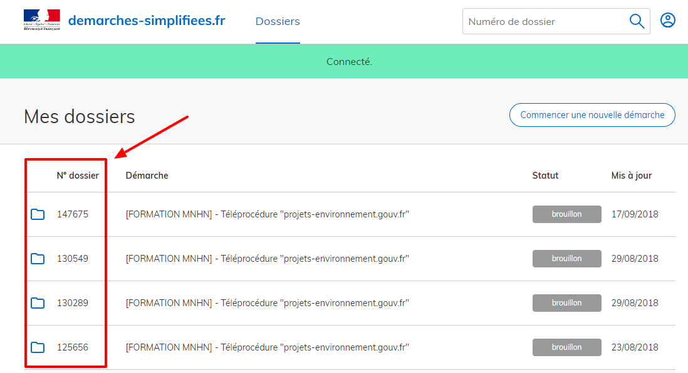

.. Etape 1 : Déclaration de l'étude d'impact sur demarches-simplifiees.fr

Etape 1 : Déclaration de l'étude d'impact sur demarches-simplifiees.fr
======================================================================

La constitution du dossier par les maîtres d’ouvrage concernant la déclaration de l’étude d’impact se fait grâce au téléservice en ligne demarches-simplifiees.fr.

.. raw:: html

   <video controls src="../../_static/processus_dbb_demarches_simplifiees.mp4" width=100% frameborder="0" allowfullscreen></video>

**1.** Démarrez la télé-procédure de votre projet via le site projets-environnement.gouv.fr ou allez sur `demarches-simplifiees.fr <https://www.demarches-simplifiees.fr/commencer/projets-environnement-gouv-fr>`_ .

**2.** Si vous vous connectez pour la première fois sur demarches-simplifiees.fr, créez un compte ou utilisez vos identifiants FranceConnect. Sinon renseignez l'identifiant et mot de passe de votre compte demarches-simplifiees.fr.
 
**3.** Renseignez le **SIRET de votre établissement**.

**4.** Cochez la case « J'autorise les décideurs publics à vérifier les informations de mon organisation auprès des administrations concernées. Ces informations resteront strictement confidentielles. » et passez à l’étape suivante.

**5.** Positionnez la **zone d’emprise de votre projet** directement en traçant la zone sur la carte ou en renseignant une adresse. Par défaut, la carte est centré sur la zone de l’établissement renseigné précédemment. 

.. warning:: Le tracé réalisé à ce niveau sera reporté sur la cartographie utilisé sur le site projets-environnement.gouv.fr, site de consultation des études d'impact par le grand-public. Ce tracé n'est pas engageant pour la suite du processus.

**6.** Après avoir lu les informations concernant la télé-procédure, renseignez les différents champs. Les **champs obligatoires** sont marqués par une *****

**7.** Enregistrer votre brouillon, et poursuivez le processus de dépôt légal afin d’obtenir les fichiers obligatoires manquants. Vous pouvez retrouver le dossier que vous venez de créer dans l’**onglet Brouillons**. 

.. tip:: Notez le **numéro de dossier** indiqué en haut de la page récapitulant les dossiers en brouillon. Il vous sera demandé lors d’une prochaine étape.

Une fois les informations relatives à l’étude d’impact indiquées sur demarches-simplifiees.fr, un lien vers l’outil de gestion des métadonnées SINP permet de poursuivre le processus de dépôt légal. Ce lien est indiqué dans le formulaire. 

Vous pouvez également accéder à la suite du processus de dépôt légal de biodiversité en cliquant `ici <https://inpn.mnhn.fr/mtd/cadre/dbb/recherche>`_ . 