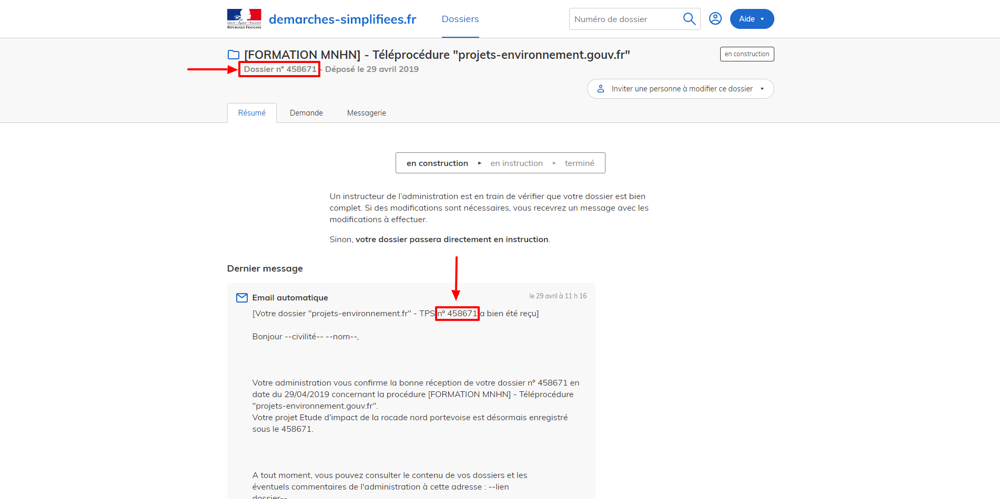

.. Etape 1 : Déclarer son projet sur demarches-simplifiees.fr

Etape 1 : Déclarer son projet sur demarches-simplifiees.fr
==========================================================

Les maîtres d’ouvrage doivent déclarer leur projet via le téléservice en ligne demarches-simplifiees.fr. Cette téléprocédure se substitue aux procédures de dépôt des dossiers en préfecture pour l'organisation des consultations publiques, telles que réalisées avant le 29 mars 2018.

.. note:: Voir le descriptif complet de la procédure sur https://www.projets-environnement.gouv.fr/pages/deposer-mon-projet/

Vous pouvez démarrer la télé-procédure de votre projet via le site `projets-environnement.gouv.fr <https://www.projets-environnement.gouv.fr/pages/deposer-mon-projet/>`_ 

.. raw:: html

   <video controls src="../../_static/processus_dbb_projets_environnement.mp4" width=100% frameborder="0" allowfullscreen></video>
   

---

ou directement sur le site :tps_url:`demarches-simplifiees.fr <>` 

Puis suivez les étapes suivantes : 
 

**1.** Si vous vous connectez pour la première fois sur demarches-simplifiees.fr, créez un compte ou utilisez vos identifiants FranceConnect. 

Sinon renseignez l'identifiant et mot de passe de votre compte demarches-simplifiees.fr.
 
**2.** Cliquez sur "Créer un nouveau dossier" et renseignez le **SIRET de votre établissement**.

**3.** Après avoir lu les informations concernant la télé-procédure, renseignez les différents champs du formulaire. Les **champs et pièces jointes obligatoires** sont marqués par une astérisque *****

.. note:: En haut du formulaire se trouve une carte. Par défaut, la carte est centré sur la zone de l’établissement renseigné précédemment. Le tracé réalisé à ce niveau sera reporté sur la cartographie utilisé sur le site projets-environnement.gouv.fr, site de consultation des études d'impact par le grand-public. Ce tracé n'est pas engageant pour la suite du processus.

**4.** Soumettez votre dossier.

.. raw:: html

   <video controls src="../../_static/processus_dbb_demarches_simplifiees.mp4" width=100% frameborder="0" allowfullscreen></video>

.. warning:: Vous devez soumettre votre dossier pour pouvoir continuer le processus de dépôt légal de biodiversité. Votre dossier passera de l'état "en brouillon" à "en construction". Celui-ci sera toujours modifiable. Les pièces jointes et l'url du certificat de dépôt pourront être transmises après-coup tant que votre dossier est "en construction". Vous pouvez retrouver votre dossier à tout moment en cliquant sur "Voir mes dossiers en cours" sur le site demarches-simplifiees.fr.

.. tip:: Notez le **numéro de dossier** indiqué sur la page de votre dossier. Il vous sera demandé lors de la prochaine étape.

.. tip:: Votre numéro de dossier vous est également envoyé automatiquement par mail et se retrouve sur la page récapitulant tous vos dossiers créés. 

.. image:: ../../images/dossier_demarches_simplifiees.png

Poursuivez le processus de dépôt légal de biodiversité en vous rendant sur l':mtd_url:`application de gestion de métadonnées </cadre/dbb/recherche>` afin de décrire le cadre d'acquisition de votre projet et le(les) jeu(x) de données associés.  

