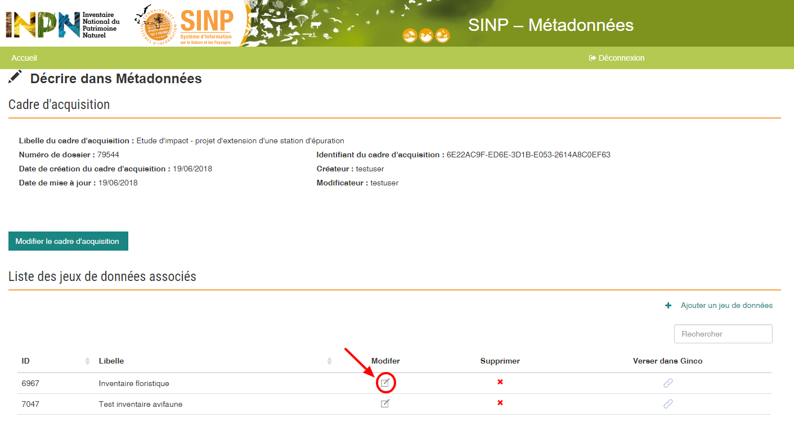
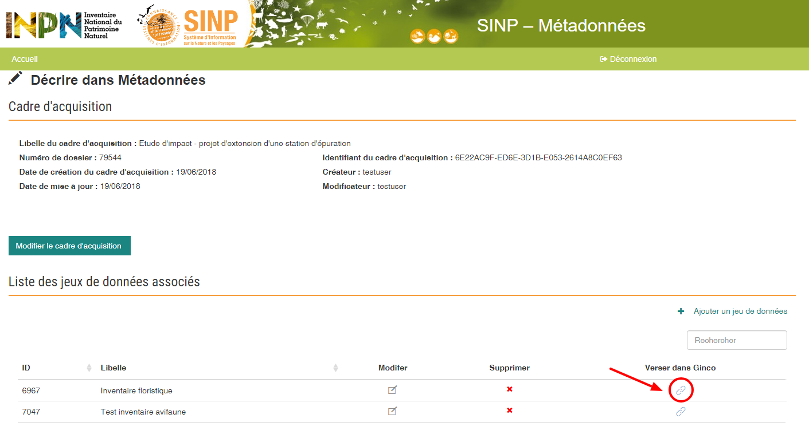

.. Etape 2 : Décrire les métadonnées du cadre d'acquisition et des jeux de données associés

Etape 2 : Décrire les métadonnées du cadre d'acquisition et des jeux de données associés
========================================================================================

1. Présentation globale et règles fonctionnelles de l'application de gestion des métadonnées
--------------------------------------------------------------------------------------------

L’outil de gestion des métadonnées, à travers l’instauration d’un `standard de métadonnées SINP <http://standards-sinp.mnhn.fr/category/standards/metadonnees/>`_, a pour objet de définir un **format commun de description des métadonnées attachées aux données naturalistes** en tenant compte des obligations de la directive INSPIRE et des formats de rapportage internationaux. Ce format de métadonnées spécifique est utilisé pour les échanges entre plateformes informatiques du SINP. 

L’application permet aux pétitionnaires de gérer des cadres d’acquisition de données et des jeux de données, à savoir : 

* Renseigner des fiches de cadres d’acquisition et d’y associer un ou des jeux de données,
* Modifier et supprimer ces fiches.

.. warning:: Un fichier de données ne peut être déposé sur la plateforme de Dépôt légal de biodiversité que si un cadre d'acquisition et un jeu de données ont été décrits au préalable sur l'outil Métadonnées. 

2. Concepts et définitions
--------------------------

Voir le :doc:`glossaire <../glossaire/index>`.

3. Recommandations pour la constitution des jeux de données
-----------------------------------------------------------

Les recommandations pour la constitution des jeux de données sont décrites au sein du :ref:`standard_dbb` (*Standard de fichier de données occurrences de taxons v1.0.*, UMS 2006 PatriNat, novembre 2017).

Un **jeu de données** peut être considéré comme un **regroupement de données** dans un dispositif d’informatisation et de gestion de données. Il regroupe des séries de données collectées dans le cadre de projets spécifiques ou bien acquises auprès d'un service fournisseur de données.

Dans une logique d’exploitation, un jeu de données doit rester cohérent et être issu d’un même contexte ou cadre d’acquisition. Le **cadre d'acquisition** est défini à minima par un maître d'ouvrage, un ou des financeurs, un objectif. Dans le cadre d'une procédure de dépôt légal de données brutes de biodiversité, il correspond à l'étude d'impact ou la procédure donnant lieu à une évaluation environnementale. 

Les critères déterminant le périmètre de constitution d’un jeu de données répondent à la fois à des objectifs d’exploitation et de valorisation des producteurs de données. 

**Lorsqu'il est constitué de données collectées dans le cadre d'un projet**, un jeu de données doit permettre de valoriser les acteurs qui ont participé à sa constitution. Dans sa logique d'exploitation, il est donc préconisé de grouper ces données selon les principes suivants :

* Un jeu de données par protocole de collecte.
* Un jeu de données par producteur de données.

**Lorsqu'il est constitué après acquisition auprès d'un service fournisseur**, il est préconisé de regrouper les données selon le principe suivant :

* Un jeu de données par producteur de données ou à défaut par fournisseur, en mentionnant dans le nom et la description du jeu de données sa provenance.
* Si possible, un jeu de données par protocole de collecte 

**Lorsqu'il est constitué après acquisition auprès d'une plateforme SINP**, il est préconisé de regrouper les données selon le principe suivant :

* Un jeu de données par jeu de données d'origine, en mentionnant dans le nom et le descriptif du jeu de données la provenance (producteur) et la référence (identifiant) du jeu de données source.

4. Présentation générale du processus de description des métadonnées
--------------------------------------------------------------------

.. raw:: html

   <video controls src="../../_static/processus_dbb_mtd.mp4" width=100% frameborder="0" allowfullscreen></video>  
   
**1.** Allez sur l’application :mtd_url:`Métadonnées </cadre/dbb/recherche>` et connectez vous avec votre compte INPN.

**2.** Renseignez le numéro de dossier indiqué sur demarches-simplifiees.fr

**3.** Complétez le formulaire si besoin et enregistrez le.

.. note:: Le formulaire d’édition du cadre d’acquisition est pré-rempli. Certains champs renseignés sur demarches-simplifiees.fr sont récupérés automatiquement par l'application Métadonnées. Vous avez néanmoins la possibilité d'ajouter ou supprimer des informations. Actuellement, les modifications apportées au cadre d’acquisition sur Métadonnées ne sont pas récupérées par demarches-simplifiees.fr. Cependant, cela n’impacte pas la suite du processus.

**4.** Ajoutez un jeu de données au cadre d’acquisition.

**5.** Remplissez le formulaire et enregistrez le.

5. Présentation détaillée du processus de description des métadonnées   
---------------------------------------------------------------------

5.1. Accéder à l'application de métadonnées de l'INPN
"""""""""""""""""""""""""""""""""""""""""""""""""""""

.. note:: L’application Métadonnées, tout comme l'application GeoNature et Ginco possède leur propre système d’authentification, qui n’est actuellement pas relié à celui de demarches-simplifiees.fr. Il faut se créer un compte INPN pour se connecter à l’ensemble des applications permettant la saisie et le dépôt des données brutes de biodiversité.

**1.** Accédez à l’application :mtd_url:`Métadonnées </cadre/dbb/recherche>`. L'accès peut se faire à partir de la page racine du processus de dépôt légal de biodiversité https://depot-legal-biodiversite.naturefrance.fr/

**2.** **Créez un compte INPN** s’il s’agit de votre première connexion ou **authentifiez-vous** à l’aide de l'identifiant personnel et mot de passe de votre compte INPN. 

Pour plus d'information sur la création d'un compte INPN, cliquez sur le lien suivant : :ref:`creation_compte_inpn`.

Vous êtes automatiquement connecté à l’ensemble des outils à votre disposition dans le cadre du dépôt légal des données brutes de biodiversité, mis à part demarches-simplifiees.fr.

L’application de métadonnées s'ouvre sur la page de recherche par numéro de dossier.

**3.** **Indiquez le numéro de votre dossier** soumis sur demarches-simplifiees.fr. 

Vous accédez ensuite à la page de création du cadre d'acquisition sur l'application Métadonnées. 

5.2. Le cadre d'acquisition
"""""""""""""""""""""""""""

Création du cadre d'acquisition dans l'application Métadonnées
^^^^^^^^^^^^^^^^^^^^^^^^^^^^^^^^^^^^^^^^^^^^^^^^^^^^^^^^^^^^^^
Une fois connecté à l'application Métadonnées et indiqué le numéro de dossier :

**1.** Le formulaire de création du cadre d’acquisition de l’étude est pré-rempli. Certains champs renseignés sur demarches-simplifiees.fr sont récupérés automatiquement par l'application Métadonnées. Vous avez néanmoins la possibilité d'ajouter ou supprimer des informations. Actuellement, les modifications apportées au cadre d’acquisition sur Métadonnées ne sont pas récupérées par demarches-simplifiees.fr. Néanmoins, cela n’impacte pas la suite du processus.

Les informations du formulaire marquées par une astérisque doivent être obligatoirement renseignées.   

   .. |bouton_ajouter| image:: ../../images/bouton_ajouter.png
               :width: 5 em

.. tip:: Lorsque vous complétez les parties Maître d'ouvrage, Maître d'oeuvre et Financeur, cliquez sur le bouton |bouton_ajouter| pour enregistrer les informations que vous venez de renseigner.
   
**4.** Enregistrez le formulaire en cliquant sur [Créer].

La page d'édition d'un cadre d'acquisition s'actualise. **Le pétitionnaire peut alors ajouter un jeu de donnée afin de poursuivre le processus de dépôt légal**.

.. _modifier_CA:

Modification du cadre d'acquisition
^^^^^^^^^^^^^^^^^^^^^^^^^^^^^^^^^^^

Une fois le cadre d'acquisition créé vous pouvez le modifiez en cliquant sur le bouton [Modifier le cadre d'acquisition] à partir de la page récapitulative du cadre d'acquisition et des jeux de données associés.

.. note:: Sur cette page se trouve également l’identifiant SINP du cadre d’acquisition au format UUID attribués automatiquement par l’application.
 
.. Warning:: Le créateur de la fiche métadonnée du cadre d’acquisition est le seul à pouvoir modifier la fiche.

.. _supprimer_CA:
   
Supprimer un cadre d'acquisition
^^^^^^^^^^^^^^^^^^^^^^^^^^^^^^^^

Il est impossible de supprimer un cadre d’acquisition déjà créé. Pour ce faire, contactez l'assistance utilisateur : assistance.depobio@afbiodiversite.fr

   
5.3. Les jeux de données
""""""""""""""""""""""""

.. warning:: Avant de pouvoir créer un jeu de données dans l’application Métadonnées il faut obligatoirement avoir créer le cadre d’acquisition correspondant à ce jeu. Cette étape est également obligatoire pour pouvoir déposer un jeu de données sur la plateforme de Dépôt légal de biodiversité.

Pour accéder aux fonctionnalités rattachées à la création et la gestion d’un jeu de données : 

**1.** Rendez-vous sur :mtd_url:`l’application métadonnées </cadre/dbb/recherche>`.

**2.** Indiquez votre **numéro du dossier** pour accéder à la page récapitulative du cadre d’acquisition et jeux de données associés.

.. _créer_jdd:

Création d'un jeu de données
^^^^^^^^^^^^^^^^^^^^^^^^^^^^
Vous pouvez accéder à la page de création d'un jeu de données à partir de la page d'édition d'un cadre d'acquisition ou bien :

**1.** Cliquez sur **[Ajouter un jeu de données]** pour accéder à l’écran de création d’un jeu de données.

**3.** Renseignez à minima les **informations obligatoires** du formulaire.  

**4.** Cliquez sur **[Enregistrer]**

.. _modifier_jdd:

Modifier un jeu de données
^^^^^^^^^^^^^^^^^^^^^^^^^^

.. warning:: Le créateur de la fiche métadonnées du jeu de données est le seul à pouvoir modifier le jeu de données.

**1.** Aller sur la page récapitulative du cadre d'acquisition et jeux de données associés.

**2.** Au niveau du tableau listant les jeux de données, cliquez sur l’icône **[modifier]** pour ouvrir la page d'édition du jeu de données.

**3.** Effectuez les modifications de la même manière qu’à la création du jeu de données en s’assurant que les informations obligatoires soient renseignées.

**4.** Sauvegarder les modifications en cliquant sur **[Enregistrer]**.

Le jeu de données est modifié.

.. _supprimer_jdd:

Supprimer un jeu de données
^^^^^^^^^^^^^^^^^^^^^^^^^^^

.. warning:: Le créateur de la fiche métadonnée du cadre d’acquisition est le seul à pouvoir supprimer le jeu de données.

.. warning:: Veillez à ne pas supprimer un jeu de données pour lequel des données seraient versées sur la plateforme de Dépôt légal de biodiversité. Contactez l'assistance utilisateur en cas de besoin assistance.depobio@afbiodiversite.fr.

**1.** A partir de la liste des jeux de données associés au cadre d'acquisition, cliquez sur le bouton **[Supprimer]** situé sur la ligne du jeu de données correspondant.

**2.** Confirmer la suppression.

Le jeu de données est supprimé.

Verser dans GINCO
^^^^^^^^^^^^^^^^^

Cette action permet d’**accéder directement à la plateforme de Dépôt légal de biodiversité** et de verser des données pour le jeu de données sélectionné.

Pour ce faire, à partir de la liste des jeux de données associés au cadre d'acquisition, cliquez sur le bouton **[Verser]** situé sur la ligne du jeu de données correspondant.

