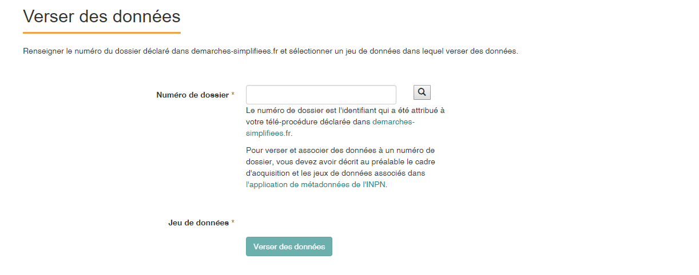

.. Etape 4 : Verser les données dans la plateforme de Dépôt légal de biodiversité

.. _versement_jdd:

Etape 4 : Verser les données sur la plateforme de Dépôt légal de biodiversité
=============================================================================

1. Présentation générale du processus de versement des données
--------------------------------------------------------------

.. raw:: html

   <video controls src="../../_static/processus_dbb_ginco.mp4" width=100% frameborder="0" allowfullscreen></video>
   
   
**1.** Allez sur la plateforme de Dépôt légal de biodiversité, en cliquant via Métadonnées sur le lien « Verser dans Ginco » |icone_verser| ou directement via :dlb_url:`la plateforme Ginco <>`. 

**2.** Sélectionnez le jeu de données à importer, puis choisissez le format de fichier à importer (CSV ou SHAPEFILE), le système de référence (SRID) utilisé, et validez.

.. warning:: Les fichiers exportés via GeoNature ont pour système de référence WGS 84 : 4326

**3.** Si votre fichier ne comporte pas d’erreur, déposez vos jeux de données. Sinon téléchargez le rapport d’erreur et corrigez votre fichier selon les indications du rapport.

**4.** A la suite du dépôt, téléchager le certificat de dépôt du jeu de données.

2. Présentation détaillée du processus de versement des données
----------------------------------------------------------------

Une fois que le cadre d’acquisition du(des) jeu(x) de données et le(les) jeu(x) de données correspondant(s) au projet indiqué sur demarches-simplifiees.fr sont décrits, les données peuvent être versées dans la plateforme Ginco de Dépôt légal de biodiversité.

Pour y accéder, cliquez :dlb_url:`ici <>`.
Une fois connecté avec votre identifiant INPN, plusieurs onglets sont visibles.

.. image:: ../../images/DLB_accueil_connexion.png

2.1. Sélectionner et importer un jeu de données via l'identifiant du dossier de demarches-simplifiees.fr 
""""""""""""""""""""""""""""""""""""""""""""""""""""""""""""""""""""""""""""""""""""""""""""""""""""""""

Sélectionner un jeu de données
^^^^^^^^^^^^^^^^^^^^^^^^^^^^^^ 
.. note:: Il est possible de passer cette étape en cliquant sur [Verser dans GINCO] sur l’application Métadonnées. Cette action permet d’accéder directement à la plateforme et d’utiliser le jeu de données sélectionné pour l’importer.

**1.** Cliquez sur [Verser des données] dans la barre de menu.

**2.** Indiquez le numéro de dossier de demarches-simplifiees.fr et le jeu de données dans lequel vous souhaitez insérer votre fichier de données brutes. 

Si vous souhaitez créer une nouvelle fiche de métadonnée de jeu de données, un lien vers l’application de métadonnées de l’INPN vous est proposé.

**3.** Validez le formulaire via le bouton [Verser des données].

Choix du format du fichier à importer
^^^^^^^^^^^^^^^^^^^^^^^^^^^^^^^^^^^^^

Une fois le choix du jeu de données à importer est fait, vous devez choisir le format sous lequel vous souhaitez l’importer. Deux formats de fichier sont possibles : csv ou shapefile.

**1.** Choisissez le format en cliquant sur l’onglet correspondant. 

.. image:: ../../images/DLDBB_jdd_format.png

**2.a.** Si vous choisissez de transmettre votre ou vos fichiers en format csv, sélectionnez le fichier, renseignez le système de référence (SRID) de vos données (code EPSG des géométries des observations), puis cliquez sur [Valider].
Un encart d’informations succinctes situé plus bas présente les principaux systèmes de référence utilisés Les données seront automatiquement converties en WGS84 lors de l’import dans la plateforme

.. warning:: Les fichiers doivent peser moins de 150 Mo.

Vous pouvez télécharger un fichier d’exemple selon le format choisi, contenant dans le cas du CSV :

* Une ligne d’en-tête avec les noms des champs définis dans la configuration du fichier d’import,
* Une ligne commentée indiquant leur caractère obligatoire (signalé par une étoile), et le format des dates.

**2.b.** Si vous choisissez de transmettre votre ou vos fichiers en format shapefile, sélectionnez le fichier, puis cliquez sur [Valider].

.. warning:: Les fichiers Shape doivent, pour être acceptés par l’application, comprendre un fichier .prj indiquant le système de coordonnées utilisé.

Après avoir choisi le fichier à importer vous êtes redirigé vers la page de gestion de vos jeux de données où apparaît un tableau listant vos jeux de données et fichiers associés.

Transférer votre ou vos fichier(s)
^^^^^^^^^^^^^^^^^^^^^^^^^^^^^^^^^^

Une fois le choix du format de fichier effectué, les informations nécessaires renseignées, et que vous avez validé ces éléments, le transfert du fichier se fait automatiquement. 

**1.** Le transfert du fichier peut prendre un certain temps en fonction de sa taille. Une barre de progression indique le pourcentage des traitements réalisés et de données importées. 

               

               
**2.** Le résultat de l’import est ensuite affiché :  |etat_ok| ou |etat_error|

**3.** Dans le cas où l'état du fichier importé est |etat_error|, un rapport d'erreur est disponible et accessible dans la colonne [Action] ; ce rapport d'erreur liste les erreurs rencontrées lors des différentes phases de contrôles et d’import, pour vous aider à corriger le fichier versé. 

.. |ajout_fichier| image:: ../../images/bouton_ajouter_fichier.png
               :width: 8 em
               
Après avoir chargé ce premier fichier et **avant de procéder au dépôt définitif de vos données** il est possible d’ajouter d’autres fichiers à ce jeu de données via la page de gestion de vos jeux de données ainsi que la page de gestion de tous les jeux de données, en cliquant sur |ajout_fichier|

2.2. Phases de contrôles et rapport d'erreur
""""""""""""""""""""""""""""""""""""""""""""

Fonctionnement des phases de contrôles
^^^^^^^^^^^^^^^^^^^^^^^^^^^^^^^^^^^^^^

En cas d’erreur lors de l’import, la nature et la localisation des erreurs sont indiquées dans le rapport d'erreur disponible pour chaque soumission sur la page listant les jeux de données. Le service d’import détecte les erreurs en 3 étapes :

**ÉTAPE 1**

Dans un premier temps, le service d’import s’assure que la ligne d’en-tête du fichier importé est correcte :

* pas de nom de colonne en doublon ;
* pas de nom de colonne inconnu dans le modèle d’import ;
* pas de colonne obligatoire manquante ;

Le nom des colonnes doit correspondre exactement aux **noms courts** indiqués dans le standard de fichier de données brutes de biodiversité publié au Bulletin officiel et fournis dans le modèle proposé en téléchargement.

Toute la ligne est évaluée pour ces 3 contrôles. Si une erreur est relevée, l’import est rejeté et l'erreur sera indiqué dans le rapport d'erreur.

**ÉTAPE 2**

Les erreurs sont enregistrées au fur et à mesure. Elles ne sont pas bloquantes pour le reste de la ligne ou du fichier, dans la limite de 1 000 erreurs, auquel cas les contrôles s’arrêtent.

**Erreur de conformité** : ce sont les erreurs de format, et de valeurs non conformes aux nomenclatures et aux référentiels (pour les valeurs de type code) listés dans le standard de fichier de données brutes de biodiversité.

**Erreur de cohérence** : ce sont des erreurs spécifiques au standard de fichier de données brutes de biodiversité, qui concernent souvent la cohérence entre plusieurs champs ; par exemple, certains champs doivent être remplis (ou non) en fonction de la valeur prise par d’autres champs.

Le service d’import lance les contrôles de conformité et de cohérence vis à vis du `standard de fichier de données brutes de biodiversité <http://www.naturefrance.fr/sites/default/files/fichiers/ressources/pdf/standard_fichier_depot_donnees_brutes_biodiversite_v1.pdf>`_.

**ÉTAPE 3**

Cette étape concerne les contrôles sur le champ géométrique ainsi que les erreurs identifiées lors de l’insertion des données en base (bloquantes pour le reste de la ligne).

Localisation des erreurs et étude de cas d’erreur
^^^^^^^^^^^^^^^^^^^^^^^^^^^^^^^^^^^^^^^^^^^^^^^^^

Sur le rapport d'erreur, la ligne où est localisée l’erreur est indiquée, ainsi qu’un message permettant d’identifier les champs en erreur.

Des **erreurs de conformité** ont lieu lorsque :

* Le **fichier importé** est **vide**

* Un des **champs obligatoires** n’est pas indiqué

* Une **colonne obligatoire** est manquante dans la ligne d’en-tête du fichier d’import

* Le **nombre de champs** est incorrect. Cette erreur peut arriver notamment : 

      * si le séparateur de champ dans le fichier csv n’est pas un point-virgule ; 
      * s’il existe des champs vides en fin de ligne, qui n’ont pas été comptés par le tableur ; 
   
.. tip:: Le fichier doit contenir le bon nombre de champs, séparés par des points-virgules. Cette erreur peut être résolue en insérant une ligne d’en-têtes en haut de fichier (commençant par //).

   
* Le **nom du champ** est incorrect 

Le nom de la colonne indiqué dans la ligne d’en-tête du fichier csv n’existe pas dans le modèle d’import. Vous devez modifier votre fichier.

* Une **ligne** est **dupliquée** 

Cette erreur survient lorsque l’on tente de livrer des données avec un identifiant producteur qui existe déjà dans des jeux de données déjà intégrés par le même producteur.

.. tip:: Il faut soit supprimer la donnée précédemment importée, voire le jeu de données entier, soit modifier les identifiants dans le jeu de données que l’on cherche à livrer.
   
* Des **noms de colonnes** sont en double 

* Le **format** et/ou le **type du champ** n’est pas respecté

.. tip:: Voir le :ref:`Format_des_dates`.

* La **chaîne de caractères** est trop longue ; 

Cette erreur survient si la valeur du champ comporte trop de caractères. 

.. tip:: La limite pour les chaînes de caractère est de 255 caractères.

* La **valeur** indiquée est incorrecte 

La valeur donnée n’est pas reconnue et empêche l’exécution du code (**remplissage automatique de champs**).

* La **géométrie** est invalide 

La valeur de la géométrie ne correspond pas au format WKT.

* Mauvais **SRID** pour la géométrie 

L’identifiant du système de coordonnées (SRID) indiqué ne correspond pas à celui des données. C’est-à-dire que l’identifiant du système de référence indiqué sur la page d’import du fichier ne peut pas correspondre aux coordonnées indiquées dans le champ géométrique du fichier importé.

Des **erreurs de cohérence** ont lieu lorsque :

* Des **champs obligatoires conditionnels** sont manquants 

Il existe des groupes de champs « obligatoires conditionnels », c’est à dire que certains champs doivent être fournis obligatoirement si d’autres champs le sont. 
Par exemple, si l’un des champs décrivant l’objet “Commune” est fourni, tous doivent être fournis.

* Des **tableaux** n’ont pas le même nombre d’éléments

Certains champs de type tableaux doivent avoir le même nombre d’éléments. Par exemple codeCommune et nomCommune (et les éléments doivent se correspondre).

* Version **Taxref** manquante 

Si un code de taxon est fourni (dans cdNom ou cdRef), alors la version du référentiel taxonomique utilisé doit être indiquée.

* Le **géoréférencement** est manquant 

Un géoréférencement doit être fourni, c’est à dire qu’il faut livrer : soit une géométrie, soit une ou plusieurs commune(s), ou département(s), ou maille(s), dont le champ “typeInfoGeo” est indiqué à 1.

* Plusieurs géoréférencements sont indiqués

Un seul géoréférencement doit être livré ; un seul champ “typeInfoGeo” peut valoir 1.

* La **période d’observation** est incorrecte

La valeur de jourdatedebut est ultérieure à celle de jourdatefin ou la valeur de jourdatefin est ultérieure à la date du jour.

2.3. Gérer et déposer les jeux de données
"""""""""""""""""""""""""""""""""""""""""

Accéder à la liste de vos jeux de données
^^^^^^^^^^^^^^^^^^^^^^^^^^^^^^^^^^^^^^^^^
 
Lorsque vous êtes authentifié sur la plateforme, cliquez dans la barre de menu sur [Jeux de données] > [Gérer mes jeux de données]. 

Cette page de gestion des jeux de données liste l’ensemble de vos jeux de données ainsi que leurs actions associées.

Un tableau regroupe les jeux de données existants en indiquant leur titre et leur identifiant de métadonnées attribué automatiquement par l'application. Au sein d’un jeu de données, ce tableau liste les fichiers de données qui ont été soumis à l’application. Pour chaque soumission, on visualise :

* le nom du fichier
* le nombre de lignes (plus exactement le nombre de données) que comporte le fichier
* le statut de la soumission (en cours, |etat_ok|, |etat_error|)

Actions réalisables sur un jeu de données
^^^^^^^^^^^^^^^^^^^^^^^^^^^^^^^^^^^^^^^^^

**Visualiser la page de détail d’un jeu de données**

Il est possible de visualiser le détail d’un jeu de données en cliquant sur le titre du jeu de données.

La page détaillant un jeu de données est composée de deux parties.

**1.**	Des informations concernant la métadonnée associée au jeu de données. Il est notamment possible d’y télécharger la fiche de métadonnée.

**2.**	Des informations concernant les versements effectuées dans le jeu de données.

Un lien permet d’ajouter un nouveau fichier au jeu de données en cours de visualisation.

Il est possible de mettre à jour la fiche de métadonnée et les informations la concernant via le bouton “Mettre à jour les métadonnées depuis l’INPN”.

Enfin, si le jeu de données ne comporte aucun versement il est possible de le supprimer.

**Ajouter un fichier au jeu de données**

Pour chaque jeu de données importé il est possible de lui associer plusieurs fichiers. Pour cela cliquez sur |ajout_fichier| dans la colonne **[Fichiers]** du tableau.
Vous serez alors redirigez vers la page d'ajout de fichier et de chargement des données.

**Supprimer un jeu de données**

La suppression d'un jeu de données n’est possible que si le jeu de données n'a pas été déposé. 

Pour supprimer un jeu de données il est nécessaire de supprimer tous les fichiers qui y ont été transférés puis de supprimer le jeu de données.

**Télécharger un rapport**
 
* **Le rapport d'erruer** est liste les erreurs rencontrées lors du transfère de fichier.
* **Le rapport de sensibilité** est un fichier CSV listant les données sensibles du jeu de données (le calcul de la sensibilité fait partie des traitements réalisés par l’application lors de l’import). Ce rapport est téléchargeable seulement si le statut de la soumission est OK.
* **Le rapport des identifiants SINP** (identifiant permanent) est un fichier CSV listant les identifiants SINP attribués aux données versés. L’attribution de l’identifiant SINP est réalisé par l’application lorsque le champ du fichier est vide à l’import. Ce rapport est téléchargeable seulement si le statut de la soumission est |etat_ok|.

Procéder au Dépôt légal des jeux de données
^^^^^^^^^^^^^^^^^^^^^^^^^^^^^^^^^^^^^^^^^^^

Lorsqu’un jeu de données a été créé dans la plateforme, et qu'au moins un fichier versés dans ce jeu est validé, le déposant peut procéder au dépôt légal du jeu de données. 

.. warning:: Le dépôt légal d’un jeu de données est définitif ! Une fois qu’un jeu de données a fait l’objet d’un dépôt légal, ce jeu est clos et le déposant ne peut pas annuler son action.

               
Pour procéder au dépôt légal d’un jeu de données, il faut cliquer sur le bouton “Déposer les données” dans la colonne “Dépôt légal” matérialisé par |depot_donnees|.

Une fenêtre de confirmation valide le processus de dépôt légal. 

Après validation du dépôt légal, une barre de progression indique l’avancée du processus.

Quand le processus est terminé, plusieurs fichiers sont disponibles en téléchargement. 

