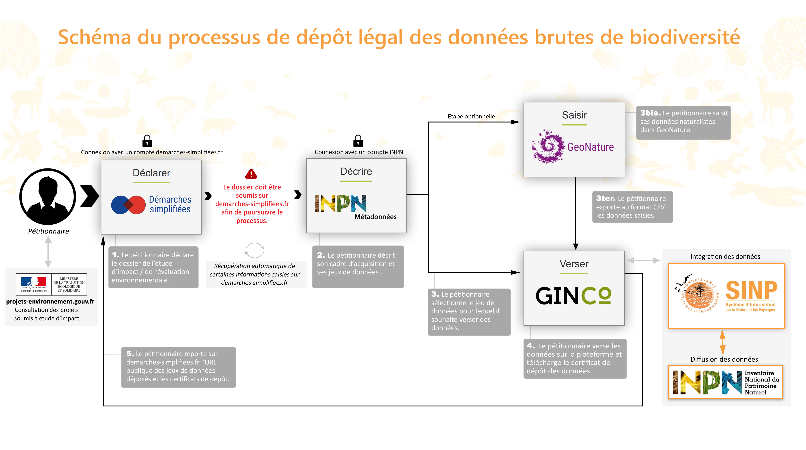

.. Principes généraux

Principes généraux
==================

Présentation des différents outils impliqués dans le processus de versement de données brutes de biodiversité
-------------------------------------------------------------------------------------------------------------

Le Ministère de la Transition écologique et solidaire a choisi d’utiliser une série d’outils existants dont la complémentarité et la convergence permet d’offrir une solution exhaustive. différents outils développés dans le cadre du `Système d’Information sur la Nature et les Paysages <http://www.naturefrance.fr/sinp/presentation-du-sinp>`_ (SINP) – à savoir une plateforme GINCO dédiée, l’application de gestion des métadonnées du SINP – en y associant les applications Géonature, développée par le Parc National des Écrins, et TPS, outil de dématérialisation des procédures administratives, afin de répondre aux obligations légales des maîtres d’ouvrages concernant les données brutes de biodiversité (loi du 8 août 2016).

.. image:: ../../images/TPS.png
   :scale: 40%

TPS - Télé Procédure Simplifiée permet aux pétitionnaires (maîtres d’ouvrage) de venir déposer à la fois les données brutes de biodiversité et la version complète d’un dossier dans le cadre des études d’impact et évaluation environnementale soumis à l’enquête publique.

Pour plus d’information cliquez `ici <https://tps.apientreprise.fr/>`_. 

.. image:: ../../images/MTD.png

L’outil de gestion des métadonnées, à travers l’instauration d’un `standard de métadonnées SINP <http://standards-sinp.mnhn.fr/metadonnees-1-3-8/>`_, a pour objet de définir un format commun de description des métadonnées attachées aux données naturalistes en tenant compte des obligations de la directive INSPIRE et des formats de rapportage internationaux. Ce format de métadonnées spécifique est utilisé pour les échanges entre plateformes informatiques du SINP. L’outil de gestion des métadonnées SINP permet de renseigner le cadre d’acquisition des données et le ou les jeux de données associés.

.. image:: ../../images/geonature_ecrins.png

Géonature est un outil naturaliste open source développé initialement par le Parc National des Ecrins. Cet outil est mis à disposition des utilisateurs n’ayant pas d’outil naturaliste ou de système interne de gestion de données naturaliste. Géonature permet de déployer un système d'informations complet pour la gestion des données Faune/Flore d'une structure, allant de : la gestion des référentiels (taxonomiques et utilisateurs), à la saisie web et mobile dans différents protocoles, en passant par l'export des données selon les formats attendus par chaque partenaire.

Pour plus d’information cliquez `ici. <http://geonature.fr/>`_

.. image:: ../../images/ginco.png

GINCO - `Gestion d'Information Naturaliste Collaborative et Ouverte <https://ginco.naturefrance.fr/>`_ est une application co-developpée par le Ministère de la Transition écologique et solidaire (MTES), l'Institut national de l'information géographique et forestière (IGN), et le Museum National d’Histoire Naturelle (MNHN). Elle s’inscrit dans le cadre du SINP dont le but est de faciliter la mise en relation d’acteurs en vue d’améliorer la gestion et la circulation d’informations géolocalisées en offrant un cadre méthodologique de référence. 
GINCO assure les principales fonctions de plateformes régionales et thématique du SINP - à savoir la déclaration, le traitement et la diffusion des jeux de données transmises par les producteurs de données - ainsi que de plateforme de dépôt légal des données brutes de biodiversité. 

Processus de dépôt légal de données brutes de biodiversité
----------------------------------------------------------

Le processus de dépôt légal de données brutes de biodiversité se déroule en 5 grandes étapes - dont 1 optionnelle - passant par les différents outils indiqués précédemment : 

  **1.** Déclaration de l’étude de biodiversité dans l’outil de télé procédure simplifiée TPS,

  **2.** Description des métadonnées SINP dans l’outil de gestion des métadonnées de l’INPN,

  **3.** Saisie de données brutes de biodiversité dans l’outil Géonature dans le cas où l’utilisateur n’a pas d’outil naturaliste interne à sa disposition (étape optionnelle),

  **4.** Versement des données sur la plateforme de dépôt légal de données brutes de biodiversité,

  **5.** Transmission du certificat de dépôt légal dans l’outil TPS pour finaliser le processus.

Authentification partagée sur les applications permettant la saisie et le versement de données brutes de biodiversité
---------------------------------------------------------------------------------------------------------------------

Un service d’authentification partagée a été mis en place afin d’accéder à l’ensemble des outil mis à disposition dans le cadre du dépôt légal des données brutes de biodiversité, excepté pour l’application de téléprocédure TPS. Ce service d’authentification partagée passe par la création d’un compte INPN. L’identifiant et le mot de passe de l’utilisateur renseigné lors de la création de son compte INPN sont utilisés pour se connecter simultanément sur : 

* L’outil de gestion des métadonnées SINP,
* L’application Géonature,
* La plateforme de Dépôt légal.

Profils et droits sur la plateforme de Dépôt légal
-------------------------------------------------- 

3 profils de visiteurs existent sur la plateforme :

**Le profil Pétitionnaire avec les permissions suivantes :**

* Importer des données
* Visualiser les données régionales publiées
* Exporter les données (au format CSV, GeoJson, kml...)
* Editer les données 
* Exporter les jeux de données au format DEE (dépôt légal de ses jeux de données)
* Publier les données
* Gérer ses requêtes privées

**Le profil Grand public avec les permissions suivantes :**

* Visualiser les données régionales publiées
* Exporter les données (au format CSV, GeoJson, kml...)
* Gérer ses requêtes privées

**Le profil Administrateur qui a tous les droits.**
