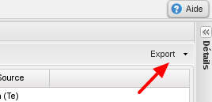
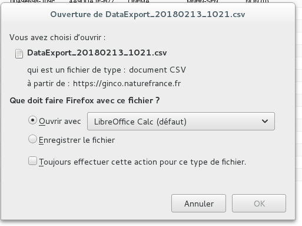

.. Tableau des résultats

Tableau des résultats
=====================

Affichage des résultats de la recherche
---------------------------------------

Sous l’onglet **[Résultats]**, les résultats de la recherche sont affichés sous forme de tableau. 

La liste des résultats est paginée, à raison de 20 lignes par page. La navigation entre les pages de résultats se fait via les flèches au bas de la grille.

En cliquant à côté des titres des colonnes, il est possible d’**ordonner l’affichage des résultats** selon les valeurs de la colonne sélectionnée.

Il est aussi possible de **masquer des colonnes** en les décochant.

Vous pouvez **déplacer les colonnes** si vous le souhaitez en les **glissant/déposant**.

Les icônes en début de ligne permettent d’afficher la fiche détaillée de l’observation, de la visualiser sur la carte, ou de l’éditer. Selon les droits de l’utilisateur, elles ne sont pas toujours toutes disponibles.

.. note:: Il est possible qu’une donnée ne comporte pas de géométrie, dans ce cas l’icône [Voir sur la carte] est grisée et inactive.

.. warning:: Attention, selon les droits de l’utilisateur, certaines valeurs de champs géométriques d’observations sensibles seront floutées (i.e : cachées). 

Par exemple, si l’application a déterminé qu’une observation est sensible et qu’elle ne peut pas être visualisée à une échelle plus précise que celle de la maille, les champs *codeCommune*, *codeCommuneCalcule*, *nomCommune*, *nomCommuneCalcule*, et *geometrie* afficheront une constante cachant l’information réelle.

Export des résultats
--------------------

En haut à droite du tableau, un menu déroulant permet d’exporter les résultats au format CSV. 

Lorsque le nombre d’observations à exporter est inférieur à 150, leur export est fait directement et au bout de quelques secondes l’application propose à l’utilisateur d’ouvrir ou d’enregistrer le fichier généré.

.. warning:: Lorsque l’export est généré en arrière plan (après apparition de la popup), il faut patienter plusieurs minutes pour recevoir le mail. Si le mail ne parvient pas, il est conseillé de vérifier qu’il n’a pas été considéré comme un spam par sa messagerie.

Les données sont sous forme tabulaire, les valeurs sont séparées par des ”;”.

.. note:: Les géométries seront exportées en Web Mercator (EPSG 3857).

