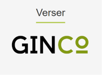
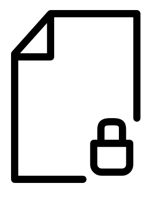
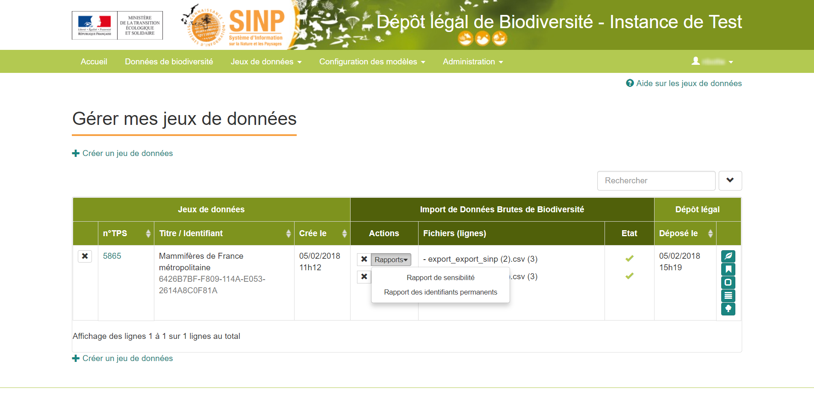
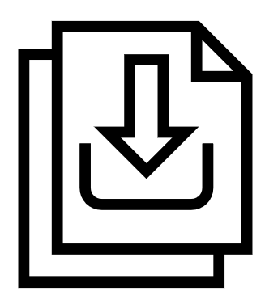
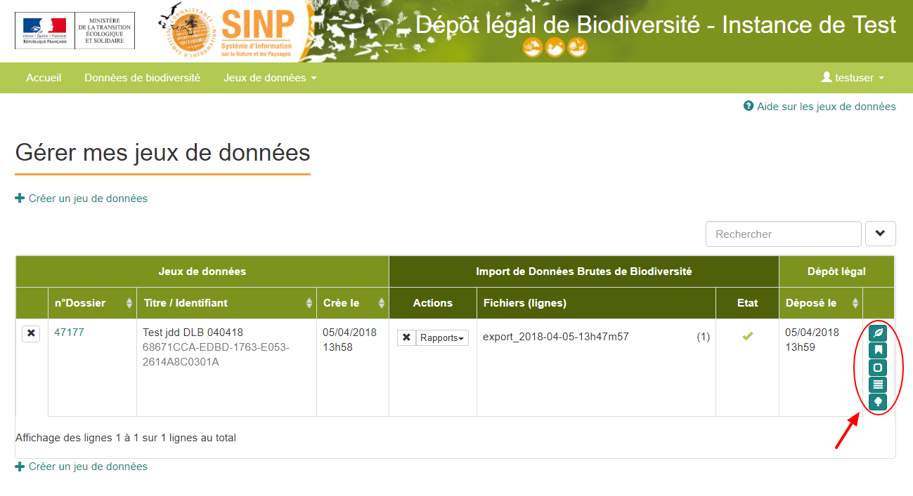

.. 2. Questions relatives aux données et jeux de données 

2. Questions relatives aux données et jeux de données 
=====================================================

2.1. Sur l’outil de gestion Métadonnées INPN
--------------------------------------------

|logo_mtd| Accédez à l'outil de `gestion de métadonnées INPN <https://inpn.mnhn.fr/mtd/>`_. 

|edition_jdd| *Edition et gestion d’un cadre d’acquisition*
^^^^^^^^^^^^^^^^^^^^^^^^^^^^^^^^^^^^^^^^^^^^^^^^^^^^^^^^^^^

Comment :ref:`editer_CA` ? 

Comment :ref:`supprimer_CA` ?

|edition_jdd| *Edition et gestion d’un jeu de données*
^^^^^^^^^^^^^^^^^^^^^^^^^^^^^^^^^^^^^^^^^^^^^^^^^^^^^^

Comment :ref:`editer_jdd` ?

Comment :ref:`modifier_jdd` ? 

Comment :ref:`supprimer_jdd` ? 

2.2. Sur la plateforme de Dépôt légal de biodiversité
-----------------------------------------------------

|logo_ginco| Accédez à la `plateforme Ginco de Dépôt légal de biodiversité <https://depot-legal-biodiversite.naturefrance.fr/versement/>`_.

|import_data| *Verser des données*
^^^^^^^^^^^^^^^^^^^^^^^^^^^^^^^^^^

Comment verser des données dans la plateforme ? 
"""""""""""""""""""""""""""""""""""""""""""""""

Le versement de données ne correspond pas à une action unique de dépôt d’un fichier. En conformité avec les règles du protocole SINP, l’intégration de données nécessite de créer et fournir une fiche de métadonnées du jeu de données au préalable.

**L’intégration de données sur la plateforme se déroule donc en 2 temps**.

**Temps n°1** : La déclaration des métadonnées sur `l’outil de gestion des métadonnées SINP <https://inpn.mnhn.fr/mtd/>`_.

**Temps n°2** : L’import du fichier de données sur la `plateforme Ginco de Dépôt légal de biodiversité <https://depot-legal-biodiversite.naturefrance.fr/versement/>`_.

Pour plus d'informations sur le versement des données cliquez sur le lien suivant :ref:`versement_jdd`.

Quelles sont les vérifications préalables à effectuer sur un fichier de données avant de l'importer ?
"""""""""""""""""""""""""""""""""""""""""""""""""""""""""""""""""""""""""""""""""""""""""""""""""""""

Avant d’importer un fichier, vérifier si : 

**1.** Le **format général du fichier** est respecté (séparateur, encodage, projection unique…) et si le fichier correspond au `Standard de fichier occurrences de taxons <http://www.naturefrance.fr/sites/default/files/fichiers/ressources/pdf/standard_fichier_depot_donnees_brutes_biodiversite_v1.pdf>`_.

Dans certains cas, des correspondances devront être faites entre les champs ou entre les nomenclatures du producteur de données et les champs obligatoires attendus. 

**2.** Les **formats des champs** sont bien respectés (dates, géométries WKT…), que les codes et référentiels du SINP sont bien utilisés.

**3.** Les données transmises constituent un **jeu de données cohérent** (par exemple que les données sont associées à un seul protocole de collecte) et éventuellement fractionner le fichier en plusieurs jeux de données.

Pour plus d'information sur les exigences attendues sur le format des fichiers et les informations pouvant être importées sur la plateforme, référez vous au :ref:`standard_dbb`.

Dans quel format de fichier peut-on importer des données dans la plateforme ? 
"""""""""""""""""""""""""""""""""""""""""""""""""""""""""""""""""""""""""""""

Les données doivent être importées à partir d’un fichier CSV ou Shapefile. 

Quels sont les opérations de calculs automatiques et d’attribution de valeurs effectués par la plateforme ?
"""""""""""""""""""""""""""""""""""""""""""""""""""""""""""""""""""""""""""""""""""""""""""""""""""""""""""

**1.** La plateforme attribue des valeurs par défaut pour trois champs du standard de données brutes de biodiversité lorsque ceux-ci n’ont pas été fournis.

+----------------------+--------+-----------------------------+
| Attribut             | Format | Valeur attribuée par défaut |
+======================+========+=============================+
| identifiantPermanent | Texte  | UID si le champ est vide    |
+----------------------+--------+-----------------------------+
| HeureDateDebut       | Time   | 00:00                       |
+----------------------+--------+-----------------------------+
| HeureDateFin         | Time   | 23:59:59                    |
+----------------------+--------+-----------------------------+

**2.** Un processus de standardisation des données est effectué par la plateforme. Ce traitement passe par différents contrôles et calcul automatique : 

* Les contrôles de conformités vérifient que les données importées respectent les formats attendus, et que les valeurs de type code sont conformes aux nomenclatures et aux référentiels du standard.
* En plus des vérifications de conformité (format et appartenance aux référentiels), des vérifications spécifiques au standard SINP sont effectuées lors de l’import.
   
   * Vérifications de cohérence entre plusieurs champs : certains champs doivent être remplis (ou non) en fonction de la valeur prise par d’autres champs.
   * L’unicité de l’identifiant producteur pour un producteur donné : si un identifiant producteur est fourni dans le jeu de données (un champ dont le mapping le fait correspondre à la clé primaire de la table), cet identifiant doit être unique, par organisme producteur, sur l’ensemble des jeux de données importés dans l’application. Il n’est donc pas possible, par exemple, d’importer plusieurs fois un même jeu de données si celui-ci comporte un identifiant producteur.
   * L’identifiant de la fiche de métadonnées doit correspondre à une fiche de métadonnées existante. Celle-ci doit donc avoir été livrée au préalable.

* Si celui-ci n’est pas fourni, un identifiant permanent est généré pour chaque donnée. Il s’agit d’un identifiant unique de l'occurrence de taxon dans le SINP attribué par le pétitionnaire ou la plate-forme de dépôt légal. Son format est numérique (UUID normalisé par l'ISO/IEC 9834-8:2008). Cet identifiant servira de clé pour réaliser les contrôles de doublons dans le SINP.

* La sensibilité est calculée à partir d’un référentiel de sensibilité. Un référentiel liste des croisements de taxons, localisations (départements), durées de sensibilité. Il permet de définir au niveau de la donnée un indice de sensibilité (entre 0 et 4) qui influe sur la visibilité de l’observation au sein de l’application.

* Lors de l’import, un rattachement administratif de chaque observation est effectué. Selon les données livrées, chaque observation sera rattachée à une ou plusieurs entités administratives de référence (communes, mailles et départements). 

.. warning:: Les données de référence actuellement utilisées dans le calcul sont les données ADMIN EXPRESS-COG carto 2017. Il se peut donc qu’il y ait des incohérences aux limites si vous utilisez un autre référentiel.

Pour plus d’information voir le document `Principes et cas d’usages pour le géo référencement des données <http://www.naturefrance.fr/sites/default/files/fichiers/ressources/pdf/delebio_principes_cas_usages_geo-referencement.pdf>`_.

|edition_jdd| *Gérer les jeux de données*
^^^^^^^^^^^^^^^^^^^^^^^^^^^^^^^^^^^^^^^^^

Comment visualiser mes jeux de données sur la plateforme ?
""""""""""""""""""""""""""""""""""""""""""""""""""""""""""

Une fois connecté, cliquez dans la barre de menu sur **[Jeux de données] > [Gérer mes jeux de données]**. 

Un tableau de tous les fichiers que vous avez soumis apparaît. 

Comment obtenir la liste des jeux de données fournis pour une télé-procédure ?
""""""""""""""""""""""""""""""""""""""""""""""""""""""""""""""""""""""""""""""

La liste des jeux de données fournis pour une télé-procédure est accessible à tous les utilisateurs lorsque le jeux de données a été déposé sur la plateforme Ginco de Dépôt légal de biodiversité.

**1.** Via l'onglet **[Jeux de données] > [Consulter les jeux de données déposés]**, vous accédez à la page listant les études et jeux de données déposés.

**2.** Le détail de la procédure apparaît en cliquant sur le numéro de dossier que vous souhaitez consulter.

Comment modifier une donnée d’un jeu de données ?
"""""""""""""""""""""""""""""""""""""""""""""""""

La plateforme de Dépôt légal de biodiversité n’a pas pour vocation la saisie de données d’occurrences. Pour ajouter ou modifier des données à un jeu de données, il est nécessaire de dé-publier puis supprimer le jeu de données et de réimporter un fichier de données complété.

Comment modifier un jeu de données ayant fait l’objet d’un dépôt légal de biodiversité ?
""""""""""""""""""""""""""""""""""""""""""""""""""""""""""""""""""""""""""""""""""""""""

Le dépôt légal d’un jeu de données est définitif ! Une fois qu’un jeu de données a fait l’objet d’un dépôt légal de biodiversité, ce jeu est clos et l'utilisateur ne peut pas annuler son action.

|sensible_data| *Sensibilité des données*
^^^^^^^^^^^^^^^^^^^^^^^^^^^^^^^^^^^^^^^^^

Comment est attribué le niveau de sensibilité sur les données ?
"""""""""""""""""""""""""""""""""""""""""""""""""""""""""""""""

L’attribution de la sensibilité sur les données implique différents processus répartis en plusieurs étapes.

**1.** Le rattachement systématique des données aux entités géo-administratives.

**2.** L’attribution automatique d'un niveau de sensibilité.

Pour plus d’information, reportez-vous à la définition des données sensibles présente dans le :doc:`glossaire <../../documentation/glossaire/index>`.

Comment récupérer le rapport de sensibilité de mon jeu de données ?
"""""""""""""""""""""""""""""""""""""""""""""""""""""""""""""""""""

Un rapport de sensibilité est disponible pour chaque jeu de données importé à partir du tableau des soumissions qui se trouve sur la plateforme de Dépôt légal de biodiversité.

Une fois connecté :

**1.** Cliquez dans la barre de menu sur **[Jeux de données] > [Gérer mes jeux de données]**. Le tableau des fichiers soumis apparaît. 

**2.** Au niveau du fichier dont vous souhaitez obtenir le rapport de sensibilité, dans la colonne "Actions" cliquez sur **[Rapports]** pour faire apparaître un menu déroulant.

**5.** Puis, choisissez **[Rapport de sensibilité]** afin de télécharger le rapport correspondant.

|control_data| *Contrôle des données*
^^^^^^^^^^^^^^^^^^^^^^^^^^^^^^^^^^^^^

Quelles sont les fonctions de contrôles implémentées ?
""""""""""""""""""""""""""""""""""""""""""""""""""""""

Les différents contrôles implémentés ont pour objectif de permettre à l’application de générer sans erreur un fichier valide et conforme de données au format standard. **La plateforme de Dépôt légal de biodiversité n’ayant pas été conçue comme un outil de gestion des données, elle ne permet pas pour l’instant de traiter des données en masse**. De ce fait, le choix a été fait de limiter au maximum la reprise des données dans l’application, de contrôler les erreurs éventuelles en amont de l’intégration et de bloquer l’import des jeux de données lorsque ceux-ci présentent des erreurs bloquantes. 

À l’heure actuelle, un jeu de données qui présente une erreur bloquante est refusé dans son intégralité. 

Il existe **deux types d’erreurs bloquantes dans le SINP**. Celles-ci ont été définies dans le cadre du Groupe de Travail Validation du SINP (Procédure nationale de validation scientifique des données élémentaires d’échange du SINP pour les occurrences de taxons). Il s'agit des :

**1.**	**Erreurs de conformité**

**2.**	**Erreurs de cohérence** 

À l’heure actuelle, seules les erreurs de conformité sont gérées par la plateforme de Dépôt légal de biodiversité.

Comment puis-je identifier les erreurs de conformité au standard dans mon fichier ? 
"""""""""""""""""""""""""""""""""""""""""""""""""""""""""""""""""""""""""""""""""""

La plateforme de Dépôt légal de biodiversité produit pour chaque jeu de données un rapport d'erreur qui est disponible sur la page listant les jeux de données. Ce rapport d'erreur se génère après avoir soumis un fichier de données si celui-ci comporte des erreurs de conformité.

Où puis-je récupérer le rapport d'erreur ?
""""""""""""""""""""""""""""""""""""""""""

Une fois connecté sur la `plateforme <https://depot-legal-biodiversite.naturefrance.fr/versement/>`_ :

**1.** Cliquez dans la barre de menu sur **[Jeux de données] > [Gérer mes jeux de données]**. Le tableau des fichiers soumis apparaît. 

**2.** Dans la colonne "Action", cliquez sur **[Rapports] > [Rapport d'erreur(s)]**.

               
|dépôt_légal| *Dépôt légal des données brutes de biodiversité*
^^^^^^^^^^^^^^^^^^^^^^^^^^^^^^^^^^^^^^^^^^^^^^^^^^^^^^^^^^^^^^

Quels sont les fichiers générés lors du dépôt légal de biodiversité et où puis-je les récupérer ?
"""""""""""""""""""""""""""""""""""""""""""""""""""""""""""""""""""""""""""""""""""""""""""""""""

Les fichiers générés lors du dépôt légal de biodiversité sont :

|dbb| **1.** Les données brutes de biodiversité (fichier .ZIP)

|certificat| **2.** Le certificat de conformité (fichier .PDF) où sont indiqués 

   * Les informations concernant la procédure de dépôt; 
   * Le détail du jeu de données; 
   * L’url publique du jeu de données que l’utilisateur doit reporter sur l’outil demarches-simplifiees.fr.

|ca| **3.** Les métadonnées du cadre d’acquisition (fichier .XML)

|jdd| **4.** Les métadonnées du jeu de données (fichier .XML)

|dee| **5.** Les données élémentaires d’échange (fichier .ZIP)

Ces fichiers se récupèrent sur la **plateforme de Dépôt légal de biodiversité**, dans l’onglet **[Jeux de données] > [Gérer tous les jeux de données]** ou **[Gérer mes jeux de données]**, au niveau de la colonne **"Dépôt légal"** du tableau récapitulatif des jeux de données déposés.

Comment obtenir un certificat de dépôt légal de biodiversité ?
""""""""""""""""""""""""""""""""""""""""""""""""""""""""""""""

Pour obtenir un certificat de dépôt légal de biodiversité il est nécessaire que l’intégration du jeu de données soit validé (jeu de données sans erreur) – validation matérialisé par l’état d’import de données OK, puis que le jeu de données soit déposé. 

Ce certificat se trouve dans la colonne "Dépôt légal" du tableau récapitulatif des études et jeux de données déposés en cliquant sur l'icône |certificat| dans le tableau récapitulatif des jeux de données déposés. 

Quelles sont les télé-procédures ayant fait l’objet d’un dépôt légal de biodiversité ?
""""""""""""""""""""""""""""""""""""""""""""""""""""""""""""""""""""""""""""""""""""""

L’ensemble des télé-procédures de l’organisme auquel vous êtes rattaché ayant fait l’objet d’un dépôt légal se trouve sur la plateforme de dépôt légal dans l’onglet **[Jeux de données] > [Consulter les jeux de données déposés]**.

Comment trouver un jeu de données ayant fait l’objet d’un dépôt légal de biodiversité ?
"""""""""""""""""""""""""""""""""""""""""""""""""""""""""""""""""""""""""""""""""""""""

Sur la plateforme de Dépôt légal de biodiversité, la liste des jeux de données déposés qui se trouve dans l’onglet [Jeux de données] > [Consulter les jeux de données déposés] donne accès au jeu de données ayant fait l’objet d’un dépôt légal. Les données brutes de biodiversité sont téléchargeables en format .ZIP.

Comment consulter les données d’un jeu de données ayant fait l’objet d’un dépôt légal de biodiversité ?
"""""""""""""""""""""""""""""""""""""""""""""""""""""""""""""""""""""""""""""""""""""""""""""""""""""""

               
Le détail des données d’un jeu de données peut se trouver sur la plateforme de dépôt légal de biodiversité dans la liste des études et jeux de données déposés via l’onglet **[Jeux de données] > [Consulter les jeux de données déposés]**. 
Cliquez téléchargez le fichier .ZIP des données brutes de biodiversité en cliquant sur l'icône |dbb| dans le tableau récapitulatif des jeux de données déposés.
